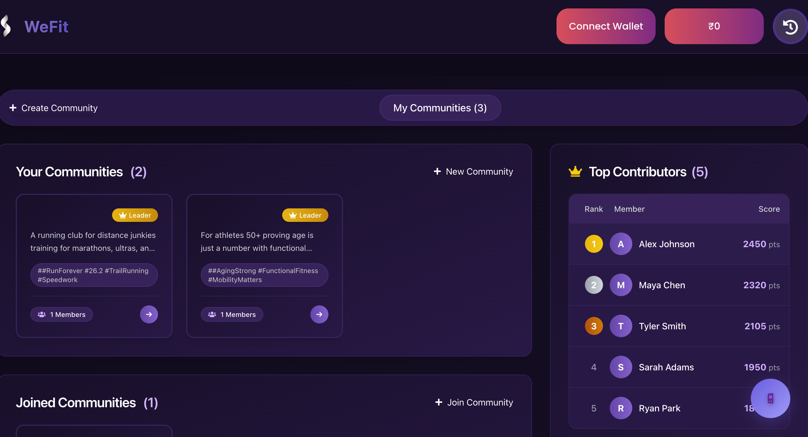

# 🏋️ WeFit - Blockchain-Powered Fitness Rewards App  

A decentralized fitness app that **rewards users** for completing workouts using **blockchain-based subscriptions, AI-driven exercise recommendations, and live activity verification** via OpenCV.  

## ✨ Features  

| Feature | Description |  
|---------|------------|  
| 🔒 **Blockchain Subscriptions** | Secure, tamper-proof payments via blockchain. Points convert to crypto/cash. |  
| 🤖 **AI-Powered Workouts** | Personalized daily tasks (steps, push-ups, squats) based on user fitness data. |  
| 📱 **Smartwatch & OpenCV Tracking** | Google Fit tracks steps; OpenCV verifies reps (push-ups, planks). |  
| 💰 **Milestone Refunds** | Earn points, unlock partial subscription refunds for consistency. |  
| 🏆 **Community Challenges** | Join/lead groups, compete for rewards (vouchers, merch, gym coupons). |  

## 🛠 Tech Stack  

- **Frontend**: React.js, TailwindCSS  
- **Backend**: Node.js, Express  
- **Blockchain**: Solidity (Ethereum), Web3.js  
- **AI/ML**: Python, OpenCV (pose estimation)  
- **APIs**: Google Fit, Smartwatch SDKs  
- **Database**: Firebase/MongoDB  

## 🚀 Deployment  

### **Prerequisites**  
- Node.js ≥ v16  
- Python ≥ 3.8  
- MetaMask (for blockchain interactions)

## ** Frontend .env (Vite)**
```bash
# .env (frontend)
VITE_GOOGLE_CLIENT_ID=your-google-client-id
```
## ** Backend.env **
```bash
# .env (backend)
PORT=3000
MONGO_URI=your-mongodb-uri
JWT_SECRET=your-jwt-secret-key
```

### **Frontend (React)**  
```bash
git clone https://github.com/Nikhita1504/wefit.git
cd wefit/frontend
npm install
npm start  # Runs on http://localhost:5173
```
### **Backend (Node.js)**
```bash
cd backend
npm install
npm run dev  # Runs on http://localhost:3000
```
### **ML model and server**

1. **Set up virtual environment**:
   - **Mac/Linux**:
     ```bash
     python3 -m venv wefit-env
     source wefit-env/bin/activate
     ```
   - **Windows**:
     ```bash
     python -m venv wefit-env
     .\wefit-env\Scripts\activate
     ```

2. **Install dependencies**:
   **OpenCV & Pose Detection model dependencies**
   ```bash
   pip install flask numpy opencv-python mediapipe flask_cors flask_socketio
   ```
   **ML Model dependencies:**
   ```bash
   pip install flask flask-cors numpy pandas tensorflow scikit-learn
   ```


    
    
    
    
    
  
